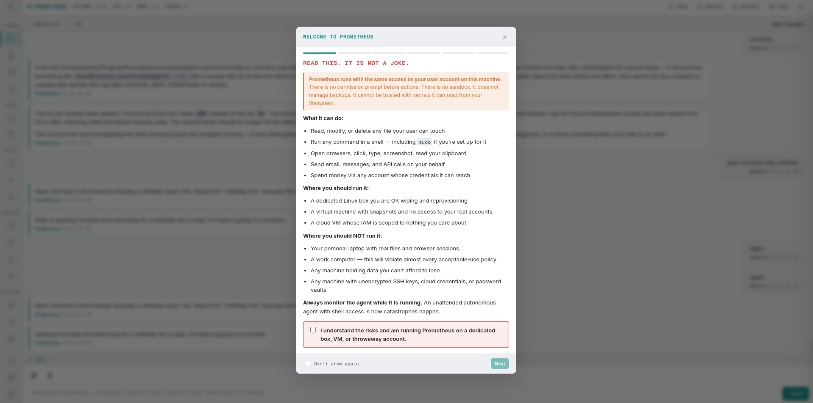
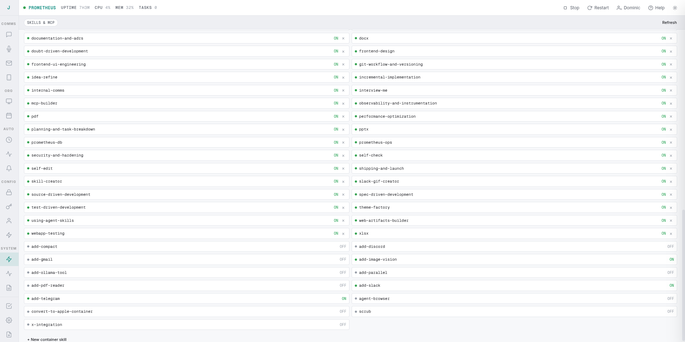
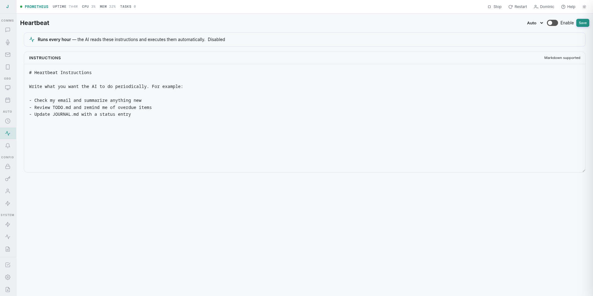
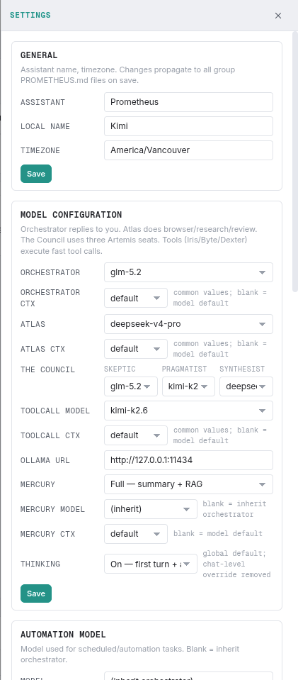
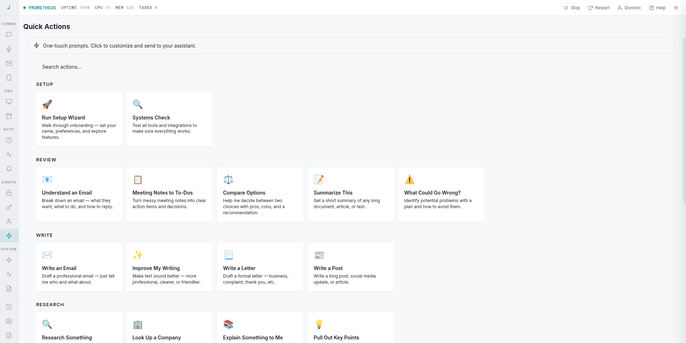
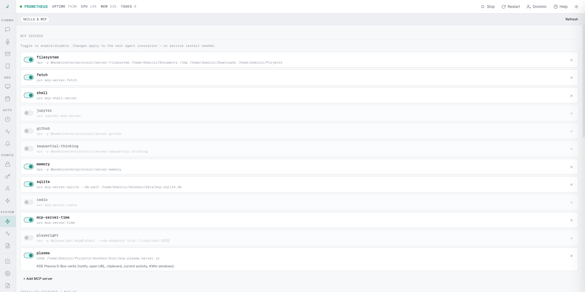
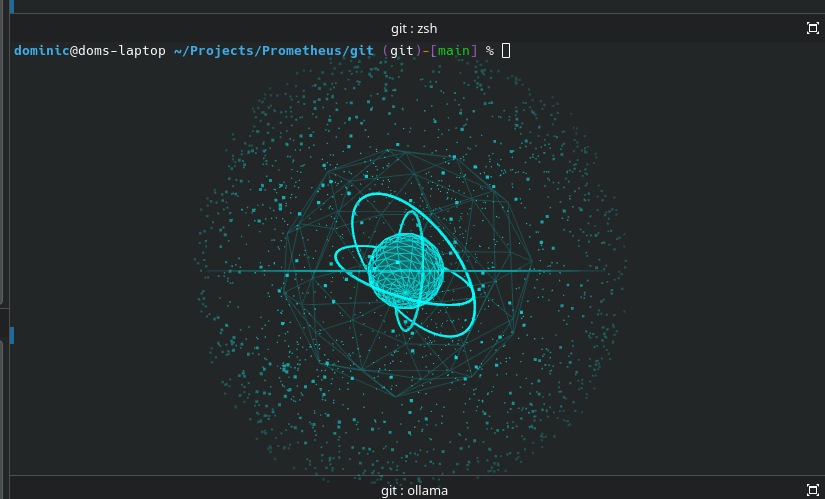

<div align="center">

# 🔥 Warden

### Your own AI. On your own machine. Hybrid by design.

[](#%EF%B8%8F-quick-start)
[](#-tech-stack)
[](#-hybrid-model-architecture)
[](#-tech-stack)
[](#-license)

**[🛡️ Warning](#%EF%B8%8F-warning--read-this-before-you-run-anything-%EF%B8%8F)** ·
**[⚙️ Architecture](#%EF%B8%8F-architecture)** ·
**[🧠 Prompt Engineering](#-prompt-engineering)** ·
**[☁️ Hybrid Models](#-hybrid-model-architecture)** ·
**[📊 Dashboard](#-dashboard)** ·
**[🧩 MCP](#-mcp-ecosystem)** ·
**[🗣️ Voice](#%EF%B8%8F-voice-assistant)** ·
**[🚀 Quick Start](#%EF%B8%8F-quick-start)**

</div>

---

# ⚠️ WARNING — READ THIS BEFORE YOU RUN ANYTHING ⚠️

## This is insane software. It is probably not safe to run.

Warden is an AI agent with **the same access as your user account**. It executes shell commands, moves your mouse and types on your keyboard, drives your real browser with your real logged-in sessions and saved passwords, reads and sends your email, and can **edit and restart its own source code**. There is no sandbox and no container. A model mistake, a prompt injection from a web page it visits, or an email it reads can do anything you can do at a terminal.



This is the warning the dashboard shows on first launch. It is not a joke and it is not boilerplate. Do not run Warden on a machine you care about unless you have read the code, understood the risks, and accepted that you are handing a language model the keys to your computer.

---

## What is it?

Warden is a personal AI assistant that lives on your desktop. It runs local models through Ollama for fast, private tasks, and reaches out to cloud models for heavy lifting — all within a single conversation. It connects to your real browser, controls your desktop, manages your email and calendar, and talks to you through whatever channel you prefer.

---

## Architecture

### The Orchestrator

A single LLM — the **orchestrator** — runs the show. It receives your message, decides what needs to happen, and delegates work to a team of specialized sub-agents. The orchestrator itself is designed to be a small, fast model (local Ollama) that routes and supervises rather than executing directly.

```
You → Orchestrator (small, local) → Atlas (large, cloud) → result → Orchestrator → You
                                   → Iris (email/calendar)
                                   → Dexter (research)
                                   → Byte (projects)
                                   → Artemis (audit)
                                   → The Council (deliberation)
```

> 💡 **The orchestrator never touches the internet directly.** It doesn't browse, search, or fetch URLs. It delegates. That separation lets the orchestrator stay small and local while the internet-connected agents run on the biggest models available.

### Sub-Agents

Each sub-agent has its own system prompt, its own toolset, and its own model. They don't share context — the orchestrator composes a self-contained task string with everything the sub-agent needs.

| Agent | Model | Tools | Role |
|-------|-------|-------|------|
| **Atlas** | Local or cloud | Shell, browser, desktop, files, web search/fetch, documents | Execution — anything that touches the internet or runs commands. |
| **Iris** | Local or cloud (local recommended) | Email, calendar, contacts, todos | Personal information management. |
| **Dexter** | Local or cloud | Web search, page fetching | Deep research — multi-source questions, comparisons, background briefs. |
| **Byte** | Local or cloud (local recommended) | Projects, deliverables, blockers, work tasks, time tracking | Work management. |
| **Artemis** | Local or cloud | Read-only file access | Critical review — audits conversations and decisions. |
| **The Council** | 3×, local or cloud | Read-only file access | Three independent seats (Skeptic, Pragmatist, Synthesist) deliberate in parallel on high-stakes decisions. |

> 🎛️ **Every agent's model is picked in the dashboard** — local Ollama or cloud, your call. Local and cloud run through the [same Ollama pipeline](#-hybrid-model-architecture), so switching an agent between them needs no code or infrastructure change. Iris and Byte are light, structured-task agents — run them on a local model and save cloud spend for Atlas, Dexter, and the Council.

### ⏰ Scheduling

There is no scheduling agent. A schedule is two things: a **crontab expression** (or a one-shot timestamp, or an interval) and a **text prompt**. The orchestrator creates them directly with its own `schedule_task` tool, and the dashboard edits them in the Scheduled Tasks panel. At fire time the prompt is injected into the running chat as a message from "Scheduler" — the orchestrator handles it like any other message, with full conversation context and all its tools. No separate agent run, no separate session.

### Async by Default

> ⚡ **Atlas runs in the background.** When the orchestrator delegates to Atlas, it gets a job ID back immediately and stays free to handle your next message. Results land in an **inbox** — the orchestrator drains it at turn end, digests what matters, and chains follow-up tasks. Urgent jobs can interrupt mid-turn.

### 🕹️ You Never Talk to Atlas

You have one conversation, with one assistant. Atlas, Iris, Dexter, and the rest never see your messages and never speak to you — the orchestrator is the only voice in the chat. It works out what you actually need, composes a self-contained brief for the right specialist, and reports back in its own words when the work is done.


Your raw message never reaches a specialist. "hey can you set the volume to like fifty percent" goes in; *"Set the system volume to 50 percent"* is what gets delegated. Every request is rewritten into a precise, self-contained brief — typos, slang, and missing context resolved — so the executing model starts from a clean statement of the goal instead of guessing at your phrasing.

And delegation isn't fire-and-forget. While Atlas jobs run, the orchestrator checks in on every one of them at a fixed interval — elapsed time, tool-call count, what the job last did and how long ago — and makes a call:

- **Progressing** → leave it alone.
- **Stuck or looping** → stop it.
- **Failed** → the failure routes back to the orchestrator automatically; it reads the full output, works out what went wrong, and re-delegates with a reworked brief. You only hear about a failure if it can't be recovered.

You ask once; the orchestrator owns the outcome — prompting the specialists, supervising them, cutting off the ones that go sideways, and correcting course until the job is done.

### Persistent Runner

> 🔥 **The agent-runner is a persistent child process** — no Docker, no containers, no cold starts between messages. It stays warm for hours (configurable `IDLE_TIMEOUT`), keeping MCP servers connected and skills loaded. Follow-up messages route over IPC in milliseconds.

---

## 🧠 Prompt Engineering

> **This is the feature that makes Warden work.** The system prompt isn't a paragraph of vibes — it's a carefully engineered control surface that has been iterated on extensively.

### 🎯 Delegation Discipline

The orchestrator is trained to state **WHAT**, never **HOW**. It doesn't see the sub-agents' tools. It can't prescribe URLs, search queries, or step-by-step instructions. The system prompt explicitly forbids it:

> *"Atlas is the internet model. It runs on a larger, more capable model than you. Never tell Atlas how to use the internet — no URLs, no search queries, no 'go to X then click Y.' Give it the goal and the facts, and stop."*

This is reinforced at three layers: the orchestrator's system prompt, the Atlas tool description (what the orchestrator sees when deciding to call it), and Atlas's own system prompt (which tells it to ignore prescribed steps).

### 🧵 Fabric Pattern Integration

Warden ships with hundreds of expert prompt patterns from the Fabric library. Every turn, the user's message is keyword-extracted and the top 5 most relevant patterns are injected into the system prompt by name and description. The orchestrator loads the full pattern on demand and bakes its framing into the Atlas task brief — giving the larger model the structure it needs without the orchestrator micromanaging the execution.

### 🎲 Dynamic Tool Selection

Warden is built to host many tools at once — the core set plus anything you add via skills and MCP servers — so the tool surface had to scale without bloating every prompt. Not all 30+ tools go into every turn. Keywords from the conversation are extracted and tools are ranked by relevance; the core routing tools (sub-agents, Read, Bash) are always included, and everything else is surfaced only when relevant. This keeps the context window lean, the model focused, and the system futureproof — add a new tool and it's available without rethinking the prompt.



### 🛡️ Defensive Loop Patterns

The tool loop has multiple circuit breakers to prevent common failure modes:
- **Intent-without-action detection** — if the model keeps saying "I'll do X" without actually calling tools, it gets nudged (capped at 2 nudges)
- **Circling detection** — consecutive useless rounds (no tool calls, no output) trigger a forced no-tools round to extract an answer
- **Degenerate output filter** — word-mash / garbled output from misconfigured models is detected and suppressed
- **Verifier sub-agent** — after effectful work (file writes, edits), a verifier pass confirms the changes

### 📝 Memory System

The orchestrator writes directly to `MEMORY.md`, `TODO.md`, and `HEARTBEAT.md` — no delegation needed. These files are loaded into context every turn.

### 💓 Heartbeat

`HEARTBEAT.md` holds standing instructions the agent executes on schedule via the task scheduler — no prompt from you required. Edit it from the dashboard's Heartbeat panel (or let the agent edit it itself) and the instructions run automatically, giving the agent persistent autonomous behavior between conversations.



### 🗜️ Context Compaction

Long conversations are compacted by a Mercury summarization layer. Older turns are condensed into memory notes, keeping the active context window focused on what matters.

### ✏️ Self-Editing

The agent can modify its own source. A built-in `self-edit` skill constrains edits to `src/` and `container/agent-runner/src/`, runs `npm run build`, gates on a successful compile, tells you what's changing, then restarts the service with `systemctl --user restart warden`. It refuses to touch `dist/`, configs, or the systemd unit, and never restarts on a failed build — so the agent can ship its own fixes without you opening a terminal.

---

## ☁️ Hybrid Model Architecture

Warden is built for hybrid operation from the ground up. Different tasks need different models, and you shouldn't have to choose one and stick with it.

### ⚙️ How It Works

Every model selection in the dashboard is per-role:

| Role | Typical Model | Why |
|------|-------------|-----|
| **Orchestrator** | Local (gemma, granite) | Fast, cheap, always available. Only routes and supervises. |
| **Atlas** | Cloud (deepseek, glm) | Heavy lifting — internet access, shell, browser, complex reasoning. |
| **Iris / Byte** | Local (recommended) | Light, structured tasks. Run them local; save cloud for the heavy agents. |
| **Dexter** | Local or cloud | Multi-source web research and synthesis. |
| **Council seats** | Cloud (3 different models) | Diverse perspectives for deliberation. |
| **Sub-agent tools** | Configurable | Tool-calling sub-agents can use a different model. |

All of this is configured from the dashboard's Settings panel — assistant name, model per role, Ollama URL, and automation settings:



### 🔄 One Pipeline, Local or Cloud

There is no separate infrastructure for cloud models. Ollama serves both local and cloud models through the same HTTP API — every agent can be flipped between them from the dashboard. The credential proxy (port 3001) sits in front so the agent never sees real API keys:
1. Validates the per-container auth token
2. Looks up and decrypts the user's API key
3. Forwards local models directly to `localhost:11434`
4. Translates to the cloud endpoint's format and injects the real key only at the proxy layer

> 💡 The repo also ships format-translation artifacts (`ollama-translate.ts`, `anthropic-translate.ts`) if you ever want to wire in Anthropic or OpenAI endpoints. They are not on the default path — by default everything is Ollama, local and cloud.

### 💾 Session Storage

All conversation history lives in a single SQLite store (`agent_sessions`), shared across every model. There are no per-vendor session directories. Switching models mid-conversation keeps the same history.

---

## 🌐 Real Browser Automation

Warden connects to your actual Chrome via Playwright and the Chrome DevTools Protocol (port 9222). Your real profile — cookies, sessions, saved passwords, extensions — everything is intact.

The browser tools operate on **DOM accessibility snapshots** and a complete set of DOM interaction tools. Each element gets a `[ref=e12]` identifier; the agent navigates, clicks, types, fills forms, selects dropdowns, hovers, switches tabs, takes screenshots, runs JavaScript with `browser_evaluate`, and waits for page state — all by ref or by URL. Screenshots exist for visual verification of end states.

Chrome runs as a persistent process with its own watchdog. It survives agent restarts. Sign into Google once; the profile persists forever.

---

## 🖱️ Desktop Control

Warden controls your actual desktop through built-in tools and MCP servers:

- **Built-in:** screenshots via `spectacle` and input synthesis via `xdotool` (mouse click, type text, send key combos). This works on X11; Wayland coverage depends on your compositor's xdotool compatibility.
- **KDE Plasma MCP server:** notifications, clipboard, opening URLs, reading current activity, KWin window verbs — all via D-Bus through the optional Plasma MCP server configured in `data/mcp-servers.json`.

It discovers the display environment automatically, even when started from systemd with no `DISPLAY` set.

---

## 📊 Dashboard

A full PWA at `http://localhost:3200`. It includes:

| | | |
|---|---|---|
| 💬 **Chat** | Main conversation interface | 🗂️ **Projects** | Deliverables, blockers, financials |
| 📁 **Files** | Browse, upload, download, manage | 🔒 **Vault** | PII-scrubbed file storage |
| 🔑 **API Keys** | Provider credentials | ⏰ **Scheduled Tasks** | Cron/interval/once automation |
| 💓 **Heartbeat** | Standing instructions on schedule | ⏰ **Alarms** | Reminders with sound + desktop notify |
| ⚡ **Actions** | One-touch prompt buttons | 📱 **SMS** | Twilio send/receive |
| 🎤 **Talk** | Voice transcription | ✉️ **Email** | IMAP inbox + send |
| 📅 **Calendar** | CalDAV synced with Kontact | 🔗 **Accounts** | Connected channels + OAuth |
| 🧩 **Skills & MCP** | Hot-pluggable capabilities | 📈 **Agent Activity** | Live verbose status |
| 📜 **Process Logs** | Live log tail ||

### ⚡ Quick Actions

One-touch prompt buttons for the things you do all the time — setup, review, write, research. Press a button instead of typing the same prompt again; each action fires a pre-written prompt into the conversation.



### 📖 Built-In Help

An agent system is only as good as the requests you give it, so Warden teaches you how to use it. On first launch the dashboard opens a **How to Use Warden** guide that leads with the one thing new users need to hear — *this is not a chatbot* — then walks the whole system: the agent roster and what each specialist actually does, how to convene the Council on a decision, how to delegate to Atlas (including parallel delegations in a single turn), the skills system, and what kinds of asks work best.


Behind the modal sits a full help site with in-depth pages. The flagship, *not-a-chatbot*, puts chatbot-style asks and agent-style asks side by side — "tell me about microservices" gets you conversation; "read `src/auth.ts` and tell me if there's a timing-safe comparison missing" gets you tools run, files read, verdicts returned — then distills the principles that make requests land: be specific about the target, parallelize independent asks, read `BLOCKED` messages instead of retrying blindly, and watch the verbose bar to see what Warden is doing right now.


---

## 🧩 MCP Ecosystem

Model Context Protocol servers give agents real capabilities without touching core code:



| Server | Capability |
|--------|-----------|
| **Filesystem** | Read, write, edit, search, manage files |
| **Fetch** | Retrieve web content |
| **Shell** | Execute commands in a live PTY |
| **Memory** | Persistent knowledge graph |
| **SQLite** | Query and manage databases |
| **Time** | Timezone-aware scheduling |
| **Plasma** | KDE Plasma D-Bus (notifications, clipboard, windows) |

MCP servers are configured in `data/mcp-servers.json` and can be toggled from the dashboard.

---

## 📡 Channels

One conversation, many doors. All channels merge into a single chat:

| Channel | How |
|---------|-----|
| 🌐 **Web Dashboard** | PWA at `http://localhost:3200` |
| ✈️ **Telegram** | Bot via grammy |
| 💚 **WhatsApp** | Baileys (no third-party API) |
| 💜 **Slack** | Bot integration |

Message from WhatsApp, continue on Telegram, check the dashboard — same context, same memory.

---

## 🛠️ Tech Stack

| Layer | Technology |
|-------|-----------|
| Runtime | Node.js 20+ with TypeScript |
| Database | SQLite via better-sqlite3 |
| Browser | Playwright (playwright-core) over CDP, driving your real Chrome — DOM interaction (navigate, click, type, read, evaluate JS, screenshot) |
| Desktop | xdotool + spectacle; optional KDE Plasma MCP |
| Terminal | Live PTY shell (tmux `warden-shell`) |
| LLM | Ollama (local + cloud) |
| LLM Routing | Credential proxy with format translation for cloud endpoints |
| Messaging | grammy (Telegram), Baileys (WhatsApp), Slack SDK |
| Email | IMAP via imapflow, SMTP via nodemailer |
| Calendar/Contacts | CalDAV/CardDAV via Radicale, synced with KDE Kontact |
| Voice | Whisper (STT), Kokoro (TTS) |
| Logging | Pino |
| Process | Single Node.js process, agent-runner as persistent child |

All LLM communication is raw HTTP fetch to Ollama. No vendor SDKs. You control the model.

---

## 🚀 Quick Start

```bash
git clone https://github.com/domdoss/warden.git
cd warden
bash install.sh
```

> 📦 The installer handles dependencies, TypeScript build, directory setup, and systemd service registration. Requires **Node.js 20+** and **Ollama**.

```bash
# Service control (Linux)
systemctl --user start warden
systemctl --user kill warden   # fast stop
systemctl --user start warden  # restart

# Dashboard
open http://localhost:3200
```

---

## 🗣️ Voice Assistant

`voice/` is a voice-first desktop companion that turns Warden into a talk-to-it assistant. Press a button, double-clap (or snap), or hit the global **F9** hotkey — speak, and the reply is spoken back.

- 🎤 Local STT (Whisper) + TTS (Kokoro) — your voice never leaves the machine.
- 👻 Hologram UI that reflects state (idle / listening / thinking / speaking).
- 📸 Vision: capture a photo, describe a scene, read text, find objects.
- ⌛ Timer: "take a break for 10 minutes".
- 🔗 Single-server, no-auth mode — no login, no user id, no Cloudflare token.



See `voice/README.md` for install and usage. Run `python single.py` once to point it at your local Warden server, then `python main.py`.

---

## ⚙️ Configuration

All settings live in `data/env/env`:

```bash
ASSISTANT_NAME=Warden
TZ=America/Vancouver
IDLE_TIMEOUT=14400000          # 4h warm-runner window
OLLAMA_URL=http://127.0.0.1:11434
OLLAMA_CHAT_MODEL=glm-5.2:cloud
TELEGRAM_BOT_TOKEN=            # from @BotFather
```

> 🎚️ Model selection is per-role via the dashboard — orchestrator, Atlas, sub-agents, and council seats can all use different models.

---

## 🤔 Why Warden?

Most AI assistants live in the cloud. They see what you type, not what you see. They run on someone else's hardware, with someone else's model, under someone else's terms.

Warden runs on **your** machine. It uses **your** browser, **your** desktop, **your** files, **your** email. It works with local models through Ollama, so your data never leaves your hardware unless you choose to send it. And when you need more power, it reaches out to cloud models — all within the same conversation, with the same memory.

It is not a demo. It is a real assistant with browser automation, desktop control, voice, email, calendar, multi-channel messaging, a plugin ecosystem, an agent architecture that can reason about your work and audit its own decisions, and a prompt engineering surface that has been battle-tested across hundreds of hours of real use.

> 🛡️ *A warden guards what's yours. This one runs on your laptop.*

---

## 📜 License

MIT — see [`LICENSE`](LICENSE) for the full text.
